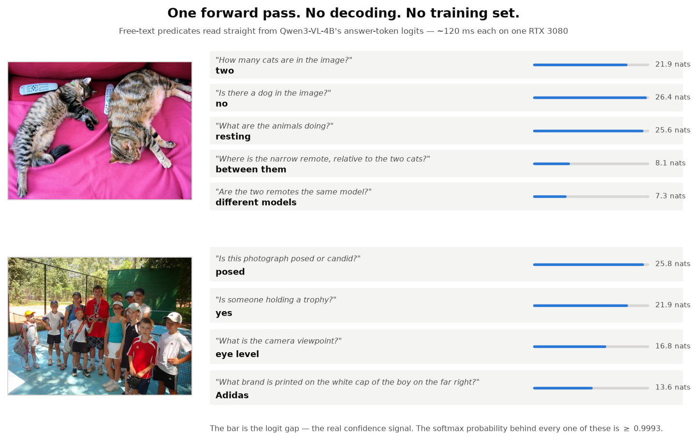

# discern

[](https://pypi.org/project/discern-vl/)
[](https://doi.org/10.5281/zenodo.22899311)
[](LICENSE)



```bash
pip install discern-vl
```

Ask a vision model a question. Get the answer out of its logits in one forward
pass — no decoding, nothing trained, no fixed label set.

```python
from discern import discern

if discern("photo.jpg", "is there an identifiable person?"):
    blur_faces()

v = discern("photo.jpg", "what is the camera viewpoint?",
            ["from above", "at eye level", "from below"])
print(v)            # at eye level  [16.8 nats]
```

It picks its own hardware: the 4B on the GPU if the checkpoint fits, the 2B on
the GPU if only that fits, the 2B on CPU otherwise — see
[Choosing where it runs](#choosing-where-it-runs) to decide yourself.

A predicate a detector cannot express — *"is this photo posed?"*, *"is the
white balance wrong?"*, *"is the meal already in progress?"* — costs one
prefill and about 90 ms.

**The confidence you get back is the logit gap in nats, not a probability** —
and the reason is not the one you would guess. The probability these systems
report is a *monotone transform of the gap*: on binary questions it is exactly
`p = sigmoid(gap)`, and both predict correctness equally well (AUC 0.895 vs
0.894 over 4,329 MMBench items). They are one signal.

What separates them is **float32**, the dtype your pipeline almost certainly
uses. Past **17.33 nats** — exactly `-ln(2**-25)` — the probability is no longer
representable in it:

| logit gap | probability | float32 |
|---|---|---|
| 12 nats | 0.99999386 | 0.99999386 |
| 20 nats | 0.999999998 | **exactly 1.0** |
| 25 nats | 0.99999999999 | **exactly 1.0** |

That is **62% of MMBench items** collapsed onto one value. In float16 the
threshold falls to 8.32 nats and it is 81%.
Within that collapsed set the gap still separates right from wrong at AUC
0.736. Same information, one scale that survives being stored.

So `discern` refuses to be used as a condition when the gap is too small:

```python
v = discern("blurry.jpg", "is the person wearing a helmet?")
bool(v)             # raises Uncertain: 1.2 nat gap, below the trust threshold
v.answer            # 'yes'  — still there if you want it anyway
v.trusted           # False
```

Below the threshold it also rotates the options and re-scores before answering,
because rotation changes the winner on 11.7% of items and those have a median
gap of 2.7 nats.

Several questions about one image:

```python
from discern import multi

for v in multi("photo.jpg", [
        "is there an identifiable person?",
        "is the white balance wrong?",
        ("what is the camera viewpoint?", ["above", "eye level", "below"]),
]):
    print(v, v.probabilities)
```

Built on [SemIf](https://github.com/TheoLeeCJ/SemIf) and the
[JEV-CPU](https://huggingface.co/Meanblock/JEV-CPU) port. The scoring engine is
vendored unchanged (MIT) so image results stay comparable to the published text
ones; see [THIRD_PARTY.md](THIRD_PARTY.md).

## Choosing where it runs

Nothing is required: `discern` measures the free VRAM against the checkpoint
size and picks. Override it when you want to.

```python
from discern import discern, load

# force the device, keep the automatic model for it
discern("photo.jpg", "is this posed?", device="cpu")

# force the model too — either one runs on either device
discern("photo.jpg", "is this posed?",
        model="Qwen/Qwen3-VL-2B-Instruct", device="cpu")   # 2.5 s, 12.7 GiB RAM
discern("photo.jpg", "is this posed?",
        model="Qwen/Qwen3-VL-4B-Instruct", device="cpu")   # 5.7 s, 21.5 GiB RAM
discern("photo.jpg", "is this posed?",
        model="Qwen/Qwen3-VL-2B-Instruct", device="cuda:0")  # 56 ms, 4 GiB VRAM

# or pay the load once, up front, and keep it
load(model="Qwen/Qwen3-VL-2B-Instruct", device="cpu")
```

The model is cached between calls, so passing a *different* model reloads it.
Pick one and stick to it inside a loop.

From the shell, same two flags:

```bash
discern photo.jpg "is this posed?" --device cpu
discern photo.jpg "is this posed?" --model Qwen/Qwen3-VL-2B-Instruct --device cpu
discern photo.jpg "what is the viewpoint?" above "eye level" below --device cpu
```

Exit code is 0 for yes, 1 for no, 2 if the gap is below the trust threshold, so
it chains:

```bash
discern photo.jpg "is there a person?" && blur-faces photo.jpg
```

**Before forcing CPU, know what it costs** — the table under
[Findings](#findings) has the numbers. Short version: ~50x slower, and on CPU
the 2B beats the 4B on speed, RAM *and* usable signal, so there is rarely a
reason to force the 4B there.

**If you have neither enough VRAM nor patience**, drop the input resolution:
cost is superlinear in visual tokens, so 448 px costs a little over half of
640 px.

## Findings

**It works, and it is fast.** On **MMBench en/dev (4,329 items)** Qwen3-VL-4B
scores **87.4%** with one forward pass per item at **91 ms/item**, and **82.2%**
under MMBench's own CircularEval protocol. On our own 22-item probe it answers
22/22, including counting, absence, a false-premise question, an unanswerable
question, and reading an Adidas mark spanning ~20×15 px.

**The probability and the gap are the same signal; only one survives float32.**
*(the bars in the figure above are the gap)* We expected the gap to
out-predict the reported probability. It does not — both reach AUC ~0.894 on
MMBench, and requiring `p >= 0.99` retains 286 of 547 errors while its exact
equivalent, `gap >= 4.60 nats`, retains 288. The real difference is that 62% of
items share the single float32 value 1.0, where the gap still ranks them at AUC
0.736. **Threshold in nats**, not because it discriminates better but because
it is the only one you can still read afterwards. It buys a real operating
point:

| gap threshold | you answer | accuracy |
|---|---|---|
| none | 100% | 87.4% |
| ≥ 12 nats | 75% | 96.8% |
| ≥ 16 nats | 66% | **98.4%** |
| ≥ 20 nats | 55% | 99.1% |

**Position bias is 1–2 nats, and the gap tells you exactly when it matters.**
Rotating the options changes the winner on **11.7% of MMBench items**. Those
items have a **median gap of 2.7 nats**; the stable ones, 22.8. The gap predicts
order-stability with **AUC 0.980**. So: rotate and average only below ~3 nats —
a rule we wrote from a 22-item probe before downloading the dataset, and which
lands on the empirical median of 4,329 items.

**The gap will not protect you from questions the model cannot answer.** On 12
normative questions (consent, retention, licensing — policy no model can
ground) the gap distribution shifts but overlaps badly: AUC 0.788, *p* = 0.006,
and the best possible threshold still admits **7 of 12**. The model claims a
photo needs legal consent at 15.6 nats, about as confidently as it reports
there is no dog in the picture at 26.4. **Use semantic ifs for perception;
keep policy in code.**

**A semantic if is an `if`, not a `switch`.** Our first cascade asked one
four-option policy question whose options were not mutually exclusive, and the
model oscillated between two *correct* answers. Independent binary predicates
composed in Python fixed it.

**The gap signal weakens as options shrink.** On POPE (9,000 binary
yes/no questions about object presence) the same readout scores **89.6%**
(F1 89.0), but the gap only reaches **AUC 0.777** against MMBench's 0.894 (and so does the
probability — they stay equivalent). With two slots
the model is *confidently* wrong: its median gap when wrong is 16.4 nats, against
5.2 on MMBench. **Ask three or more options where you can**, and demand a much
higher threshold on binary questions.

POPE also shows where object hallucination actually hides. This model does not
over-assert presence — its yes-rate is 42.7–45.6%, *below* the 50% base rate, so
the usual headline metric says it is clean. But precision falls 98.2% → 94.0% →
92.0% from the random to the popular to the adversarial split while recall stays
at exactly 83.9% throughout. The co-occurring distractors do pull it into false
positives; the aggregate yes-rate just hides it.

**Where it breaks.** The worst MMBench categories are `spatial_relationship`
(34.5% under CircularEval, near chance) and `image_quality` (57.3%). Our 22-item
probe had flagged exactly these two: its lowest gaps were the spatial-relation
item (8.1 nats) and the white-balance item (7.8). The confidence signal
identified the weak categories from a handful of examples.

**An optimisation that does not work.** Questions about one image share a
prefix — the system turn plus ~300 visual tokens — so caching it and running
only each question's tail looks free. It is numerically exact (max probability
difference 0.0) and **13–14% slower**, flat across 384, 852 and 1,812-token
images, with no crossover: the cached path loses the fast attention kernel and
that costs more than recomputing the prefix. Image preprocessing is only 3% of
the time; the forward is 97%. Kept behind `use_cache=True` and a
`verify_cache()` checker in case flash-attn flips the balance.

**It runs without a GPU, at a price worth knowing.** Measured on an i9-12900F
(8P+8E), one 640x480 photograph, float32:

| | GPU (RTX 3080) | CPU, 8 threads | RAM |
|---|---|---|---|
| Qwen3-VL-2B | 56 ms | **2,458 ms** (x44) | 12.7 GiB |
| Qwen3-VL-4B | 91 ms | 5,707 ms (x63) | 21.5 GiB |

So CPU is for batch work — filtering an archive, flagging what needs human
review — not for anything interactive. Two consequences the library applies on
its own: **on CPU it defaults to the 2B**, which is 2.3x faster, needs 9 GiB
less RAM and collapses less under float32 (26% against 62%) while giving up 4.1
points on MMBench and gaining on POPE; and it **caps itself at 8 threads**,
because on this hybrid CPU using all 24 is 2.3x slower.

Resolution is the lever if you are stuck on CPU — the cost is superlinear in
visual tokens:

| image | visual tokens | 2B on CPU |
|---|---|---|
| 448 px | 224 | 1,762 ms |
| 640 px | 384 | 3,264 ms |
| 1024 px | 852 | 8,911 ms |

**Systems note.** On a hybrid Intel CPU (i9-12900F, 8P+8E), restricting
inference to the 8 P-cores is **1.9× faster** than using 20 threads —
scheduling onto E-cores actively hurts. Overlapping a GPU vision stage with a
CPU text stage in two threads saved 22% wall clock.

Full write-up with method and statistics: [`paper/paper.pdf`](paper/paper.pdf).

## Layout

```
src/discern/__init__.py       the API: discern(image, question) -> Verdict
src/discern/_batch.py         multi(): several questions, one image
src/discern/_readout.py       the vision port; readout identical to upstream
scripts/eval_probe.py         runs the hand-built 22-item probe
src/discern/_semif/           vendored upstream engine (MIT)
scripts/cascade.py            GPU predicates -> CPU policy, threaded pipeline
scripts/bench_cpu4b.py        CPU thread sweep and policy benchmark
scripts/eval_mmbench.py       MMBench harness (resumable JSONL)
scripts/analiza_mmbench.py    accuracy, AUC, abstention curves
scripts/eval_pope.py          POPE harness (9,000 binary questions)
scripts/bench_cpu_vision.py   CPU latency: thread sweep and resolution sweep
scripts/analiza_pope.py       F1, yes-rate, precision/recall by split
scripts/exp_gap_por_tipo.py   the perceptual-vs-normative experiment
scripts/figuras.py     paper figures
data/                  benchmark decisions + 4 COCO val2017 images
results/               raw output of every run reported
paper/                 LaTeX sources and compiled PDF
```

## Running it

The library is `pip install discern-vl`. To reproduce the measurements you want
the repo and the benchmark extras:

```bash
git clone https://github.com/XxSamaxX/discern && cd discern
uv venv --python 3.11 .venv
uv pip install --python .venv/bin/python -e ".[bench]"

.venv/bin/python scripts/eval_probe.py --rows data/vl_rows_hard.json --calibrate
.venv/bin/python scripts/exp_gap_por_tipo.py
.venv/bin/python scripts/bench_cpu4b.py      # needs ~21 GiB RAM

# MMBench: ~7 min vanilla, ~25 min CircularEval
.venv/bin/python scripts/eval_mmbench.py
.venv/bin/python scripts/eval_mmbench.py --circular
.venv/bin/python scripts/analiza_mmbench.py results/mmbench_*_4329.jsonl

# POPE: ~34 min for 9,000 binary questions
.venv/bin/python scripts/eval_pope.py
.venv/bin/python scripts/analiza_pope.py
```

First run downloads Qwen3-VL-4B-Instruct (~8 GB).

## Caveats

The MMBench numbers are one model on one split, single run, with one prompt
template; no confidence intervals on latency. MMBench dev is public and may
sit in the model's training data, so 87.4% is not evidence about generalisation
— the claims that matter here are about the *confidence signal*, which is
measured within the same run and does not depend on the absolute score.

Our own 22-item probe is small and author-annotated; one label was wrong (we
called a logo illegible, the model read it correctly) and was corrected. Its
22/22 never located the model's failure boundary, which is why the MMBench run
exists.

## Citing

```bibtex
@software{oteroagraso2026discern,
  author  = {Otero Agraso, Samuel},
  title   = {discern: semantic ifs over images from vision-language logits},
  year    = {2026},
  doi     = {10.5281/zenodo.22899311},
  url     = {https://github.com/XxSamaxX/discern}
}
```

## Licence

MIT, matching upstream. See [LICENSE](LICENSE) and [THIRD_PARTY.md](THIRD_PARTY.md).
